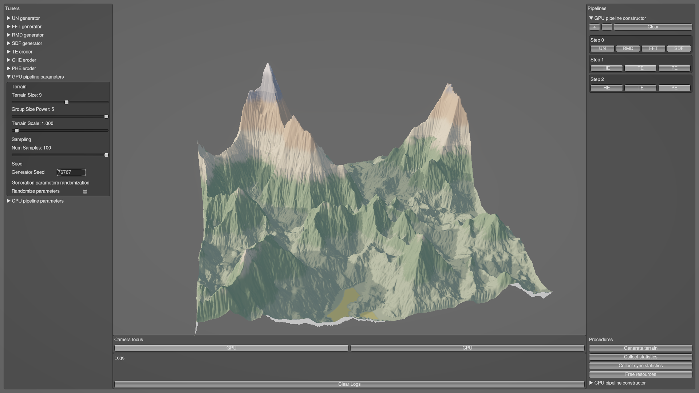
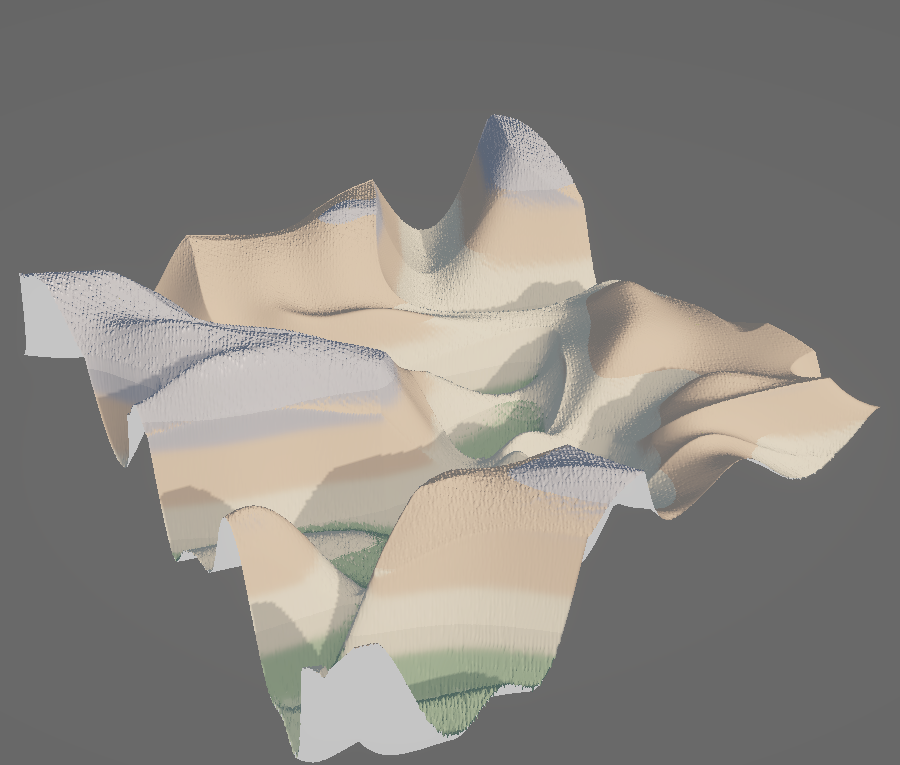
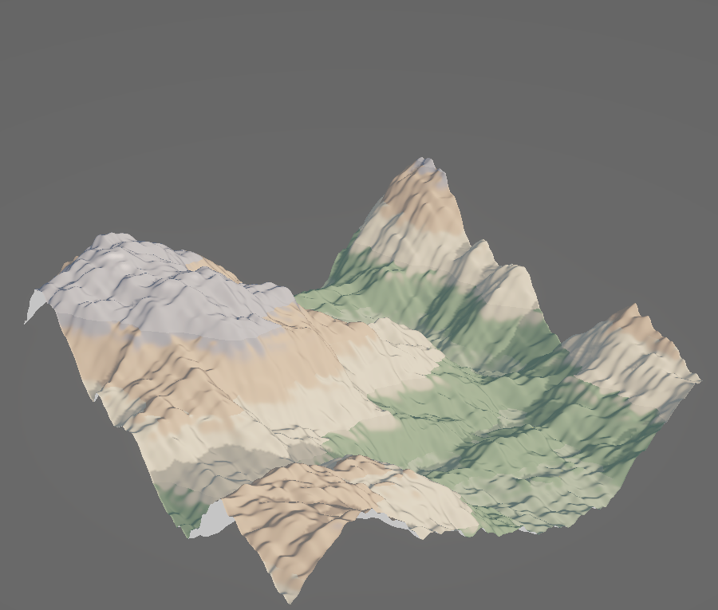
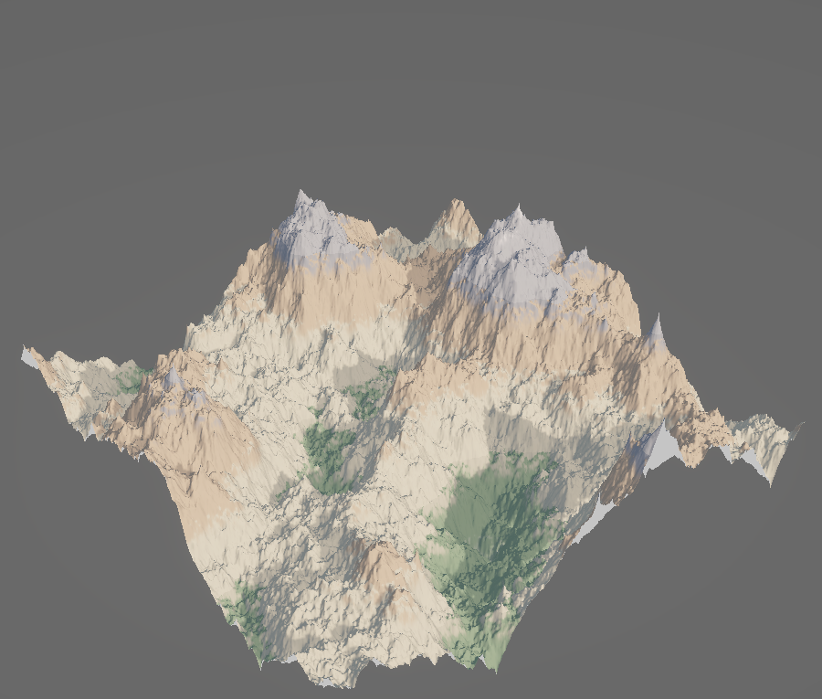
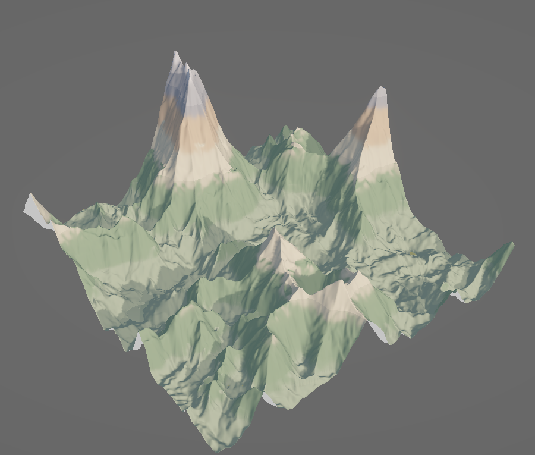
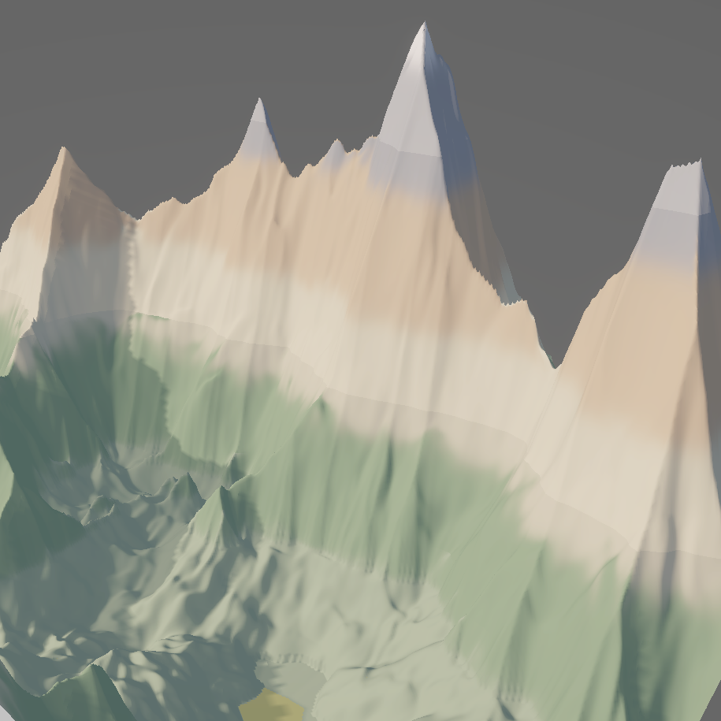
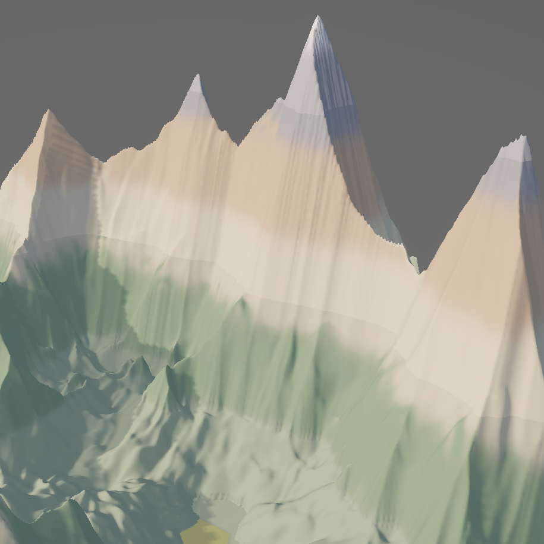
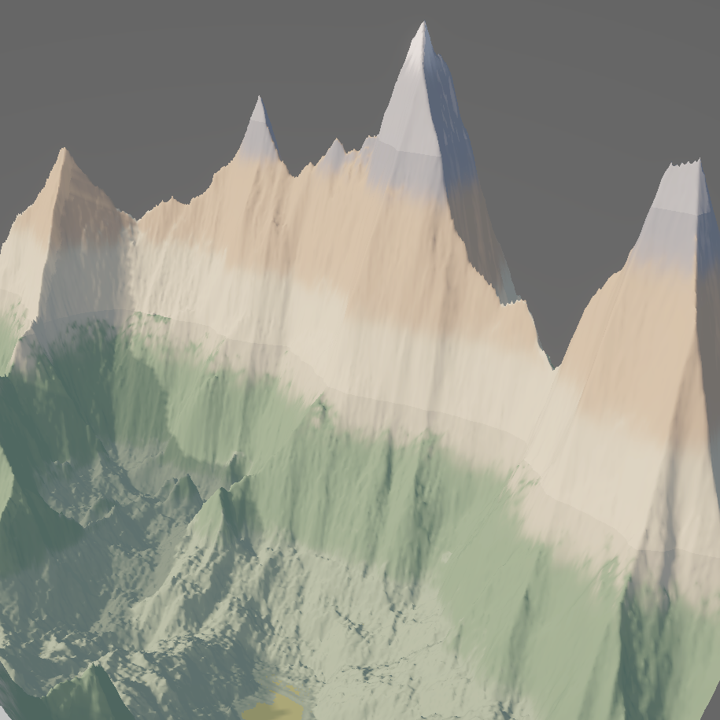
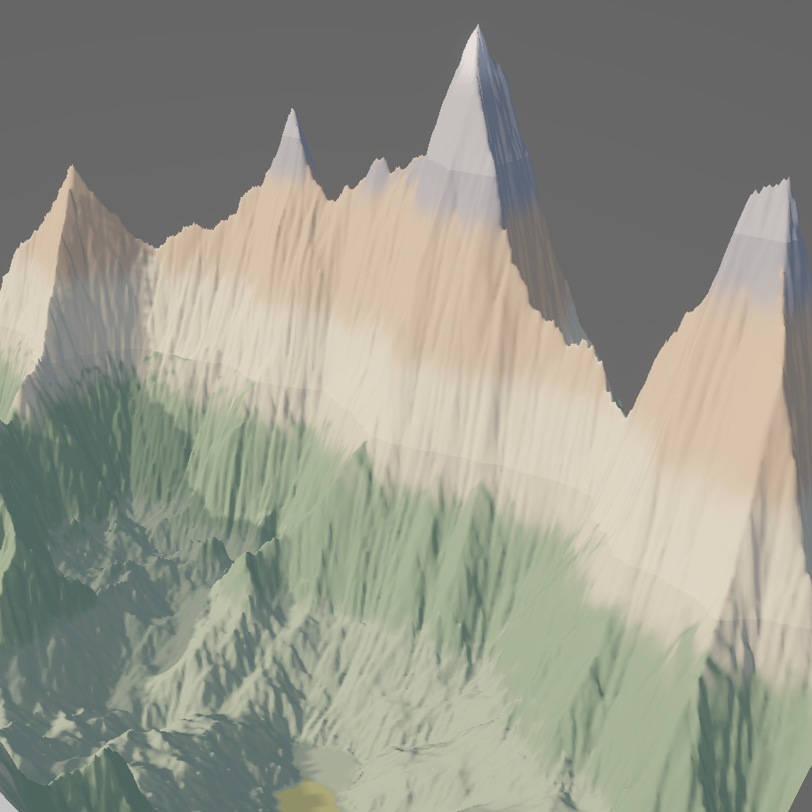

# Terrain Generation Sandbox

A Unity sandbox for building, tuning, and comparing procedural terrain generation pipelines.

The project combines several terrain generators with erosion passes, lets you run the same pipeline on CPU and GPU backends, and can export generated heightmaps and performance measurements for further analysis.

## Getting Started

Pre-built Windows and Linux binaries are available from the repository's **Releases** page. To try the sandbox without opening Unity, download the archive for your platform, extract it, and run the included executable:

- Windows: `GenerationSandbox.exe`
- Linux: `GenerationSandbox.x86_64`

To open the project in Unity, use **Unity 6000.3.2f1**. Earlier Unity versions may not import or run the project correctly.   

### Hardware requirements

There are no strict hardware requirements for smooth operation of the sandbox. The complexity of the pipelines you assemble and the target heightmap resolution define computational load.       
One should also be able to run the ML workloads (via scripts in the `experiments` folder) on consumer-level laptop. 

## Repository Layout

- `datasets/` contains the datasets used by the thesis work this sandbox was built for. The full synthetic terrain dataset is stored on a [separate drive](https://drive.google.com/file/d/1u9Mp_Yw-hP3CTShxq1P4Y_k4i2jL40bN/view?usp=sharing) because of its size.
- `experiments/` contains Python scripts for data processing, model training, metric computation, and evaluation. Python dependencies are listed in `requirements.txt`. Most script names describe their purpose, and the key scripts expose command-line interfaces.
- `experiments/models/` contains pre-trained models that were used for rating of visual appeal of terrains in the thesis. These models are intended to be used with `synthetic_aesthetics_evaluation.py`.
- `experiments/precomputed_metric_vectors/` contains CSV files with precomputed metric vectors for LLM-generated and real-world terrains. The corresponding heightmaps are stored in `datasets/`. These vectors can be passed to `model_trainer_and_bulk_metric_computer.py` to make retraining easier. You can recompute them anew if you want.
- `experiments/demo_script.sh` - this script serves as a bootstrap point for further experimentation. It mostly reproduces the plots featured in the thesis based on precomputed metric vectors. Note that you'll have to provide your own Gemini API key in `llm_baseline_provider.py` to obtain appeal score from LLM (or comment out the associated lines). This script trains rating models anew. One can instead use the ones residing in `models` directory, though. In general, you can refer to this script and the comments in it to better understand how to work with other python scripts.

## Terrain Pipelines

A pipeline is assembled from two kinds of steps: one generator followed by zero or more eroders.

### Generators

Generators create the base terrain heightmap. A pipeline can contain only one generator.

Available generators:

- **UN**: Uber Noise
- **FFT**: spectral synthesis
- **RMD**: random midpoint displacement
- **SDF**: signed distance function-based generation

| | |     
| --- | --- |
| Uber Noise | Spectral Synthesis |
|  |  |
| Random Midpoint Displacement | SDF-Based Generation |
|  |  |

### Eroders

Eroders modify the generated terrain by simulating material movement and redeposition. A pipeline can stack as many eroders as needed.

Available eroders:

- **TE**: thermal erosion
- **CHE**: cellular hydraulic erosion
- **PE**: particle erosion

| | |     
| --- | --- |
| No Erosion | Thermal Erosion |
|  |  |
| Hydraulic Erosion | Particle Erosion |
|  |  |

## Using the Sandbox

The left panel controls the selected pipeline step. Use it to tune generator and eroder parameters, choose seeds, set the heightmap dimensions, and adjust the rendered terrain scale.

The right panel is where the pipeline is assembled:

- Click `+` to add a step.
- Click `-` to remove the last step.
- Build separate CPU and GPU pipelines when you want to compare backend behavior.

The statistics collection buttons run the assembled pipeline repeatedly. Step order and parameter values stay the same between runs unless **Randomize parameters** is enabled, while seeds change on each run.

Generated heightmaps and performance measurements are written to the sandbox's persistent data directory:

- Windows: `%userprofile%\AppData\LocalLow\CoffeeSquirrel\GenerationSandbox`
- Linux: `$XDG_CONFIG_HOME/unity3d/CoffeeSquirrel/GenerationSandbox`

## Controls

- Use the **Camera focus** panel to switch between CPU and GPU terrain tiles.
- Hold the right mouse button and move the mouse to rotate the heightmap.
- Hold the right mouse button the scroll the mouse wheel to zoom in and out.

## Have Fun

You are ready to go nutz with the sandbox.
